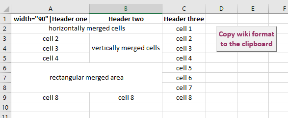
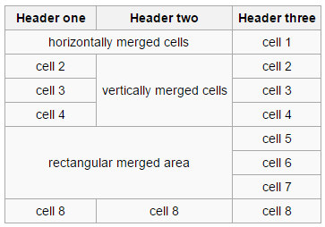

# wikitable

Export an Excel table to wikimedia format.

Both horizontally and vertically merged cells are well managed.

The output text is padded with spaces so that all the columns have the same width (with the exception of the columns with merged cells).

Bold cells are headers, other cells are normal cells.

##Example of input table:



##Example of output text:
```
{| class="wikitable sortable" style="text-align: center;"
|-
! width="90"|Header one     !! Header two              !! Header three
|-
| colspan="2"|horizontally merged cells || cell 1      
|-
| cell 2                    || rowspan="3"|vertically merged cells || cell 2      
|-
| cell 3                    || cell 3      
|-
| cell 4                    || cell 4      
|-
| colspan="2" rowspan="3"|rectangular merged area || cell 5      
|-
| cell 6      
|-
| cell 7      
|-
| cell 8                    || cell 8                  || cell 8      
|}
```

##Example of table in the wiki:


